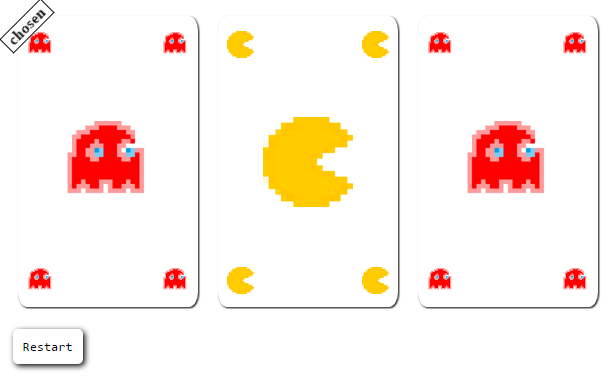

# montyhallr
A responsive Monty Hall game plugin

Try it out:

http://www.michalpaszkiewicz.co.uk/montyhallr/index.html

[](http://www.michalpaszkiewicz.co.uk/montyhallr/index.html)

# how to use

Simply add the following line to your head:
```html
<script src="http://www.michalpaszkiewicz.co.uk/montyhallr/index.js"></script>
```

Then pass the id of the element you want the game to appear inside of and the number of cards you want to play with to this function:
```js
    MontyHall.play("monty-hall-container", 3);
```

Please be aware that the game will use the width of the container, but will set its own height